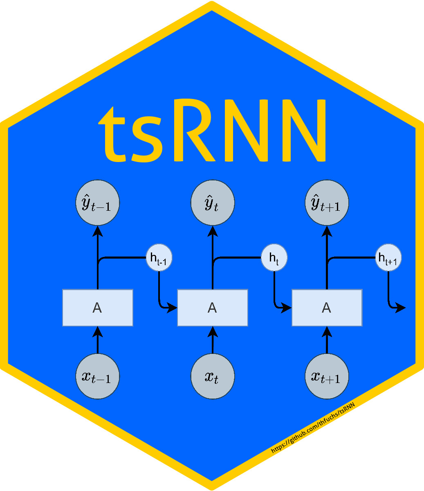

tsRNN 
======================

<!-- badges: start -->
[](https://zenodo.org/badge/latestdoi/290276771)
[](https://github.com/thfuchs/tsRNN/actions)
[](https://codecov.io/gh/thfuchs/tsRNN?branch=master)
[](LICENSE.md)
<!-- badges: end -->

Time Series Forecasting using Recurrent Neural Networks by Keras

`tsRNN` tries to provide a ready-to-use time series forecasting suite for recurrent neural networks. The package is enhanced by basic implementations of "simple" algorithms like ARIMA for comparison and provides accuracy measures as well as basic chart options for model comparisons.  

## Installation

You can install the released version of tsRNN from [GitHub](https://github.com/thfuchs/tsRNN) with:

``` r
remotes::install_github("thfuchs/tsRNN")
```

## Dependencies

Note that `tsRNN` heavily depends on [Keras](https://keras.io/) and the [TensorFlow](https://www.tensorflow.org/) Deep Learning Framework. We currently guarantee the package to work with the following versions:

Software Package | Version
---------------- | --------
Keras            | 2.4
TensorFlow       | 2.3.1

Try to install both Keras and TensorFlow through the [R package `keras`](https://cran.r-project.org/package=keras) to avoid difficulties due to misspecified installations:

``` r
library(keras)
install_keras(version = "2.4", tensorflow = "2.3.1")
```

Note: If you have a CUDA-enabled GPU set up on your machine, install the gpu-version of TensorFlow by specifiying `tensorflow = "2.3.1-gpu"`.

## Example

This is a basic example which shows you how to solve a common problem:

``` r
library(tsRNN)
## basic example code
```
